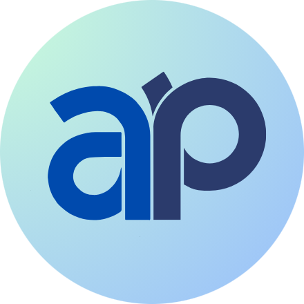

<p align="center" dir="auto">
</img><br/><br/>


<b>Go-only fork of <a href="https://github.com/encoredev/encore">Encore</a></b><br/>
<b>Open Source Framework for creating type-safe distributed systems with declarative infrastructure</b><br/>
</p>

Afterpiece is a Go-only fork of [Encore](https://github.com/encoredev/encore), focused exclusively on the Go backend framework. It provides the same powerful features for creating microservices and type-safe APIs, with a declarative approach to define infrastructure in code.

## What is Afterpiece?

- **Backend Framework:** Simplified Go-only framework for creating microservices and type-safe APIs with declarative infrastructure.
- **Local Development:** CLI automatically manages local infrastructure and provides a development dashboard with tracing, service catalog, and architecture diagrams.
- **Infrastructure Integration:** Simplified integration with cloud infrastructure using the open source CLI.

**Note:** For TypeScript support, please use the upstream [Encore](https://github.com/encoredev/encore) project.

## Installation

### Using mise (recommended)

```bash
mise use github:Olimi-org/Afterpiece@latest
```

### Build from source

```bash
git clone https://github.com/Olimi-org/afterpiece
cd afterpiece
task build
```

Or download a release from the [releases page](https://github.com/Olimi-org/afterpiece/releases).

## Example: Hello World

Defining microservices and API endpoints is incredibly simple—with less than 10 lines of code, you can create a production-ready, deployable service.

```go
package hello

//encore:api public path=/hello/:name
func World(ctx context.Context, name string) (*Response, error) {
	msg := fmt.Sprintf("Hello, %s!", name)
	return &Response{Message: msg}, nil
}

type Response struct {
	Message string
}
```

## Example: Using Pub/Sub

If you want a Pub/Sub Topic, you declare it directly in your application code and Afterpiece will integrate the infrastructure and generate the boilerplate code necessary.
Afterpiece supports the following Pub/Sub infrastructure:
- **NSQ** for local environments (automatically provisioned by the CLI)
- **GCP Pub/Sub** for environments on GCP
- **SNS/SQS** for environments on AWS

```go
import "encore.dev/pubsub"

type User struct { /* fields... */ }

var Signup = pubsub.NewTopic[*User]("signup", pubsub.TopicConfig{
  DeliveryGuarantee: pubsub.AtLeastOnce,
})

// Publish messages by calling a method
Signup.Publish(ctx, &User{...})
```

## Learn more in the docs

See how to use the backend framework in the [Encore docs](https://encore.dev/docs/go):

- **Services:** [Go](https://encore.dev/docs/go/primitives/services)
- **APIs:** [Go](https://encore.dev/docs/go/primitives/defining-apis)
- **Databases:** [Go](https://encore.dev/docs/go/primitives/databases)
- **Cron Jobs:** [Go](https://encore.dev/docs/go/primitives/cron-jobs)
- **Pub/Sub:** [Go](https://encore.dev/docs/go/primitives/pubsub)
- **Object Storage:** [Go](https://encore.dev/docs/go/primitives/object-storage)
- **Caching:** [Go](https://encore.dev/docs/go/primitives/caching)

## Local Development

When you run your app locally using the CLI, Afterpiece parses your code and automatically sets up the necessary local infrastructure on the fly.

You also get built-in tools for an efficient workflow when creating distributed systems and event-driven applications:

- **Local environment matches cloud:** Afterpiece automatically handles the semantics of service communication and interfacing with different types of infrastructure services, so that the local environment is a 1:1 representation of your cloud environment.
- **Cross-service type-safety:** When building microservices applications, you get type-safety and auto-complete in your IDE when making cross-service API calls.
- **Type-aware infrastructure:** With Afterpiece, infrastructure like Pub/Sub queues are type-aware objects in your program. This enables full end-to-end type-safety when building event-driven applications.
- **Secrets management:** Built-in [secrets management](https://encore.dev/docs/go/primitives/secrets) for all environments.
- **Tracing:** The local development dashboard provides local tracing to help understand application behavior and find bugs.
- **Automatic API docs & clients:** Generates [API docs](https://encore.dev/docs/go/observability/service-catalog) and [API clients](https://encore.dev/docs/go/cli/client-generation) in Go, TypeScript, JavaScript, and OpenAPI specification.

## Testing

Afterpiece comes with several built-in tools to help with testing:

- **Built-in service/API mocking:** Provides built-in support for [mocking API calls](https://encore.dev/docs/go/develop/testing/mocking), and interfaces for automatically generating mock objects for your services.
- **Local test infra:** When running tests locally, Afterpiece automatically provides dedicated [test infrastructure](https://encore.dev/docs/go/develop/testing#test-only-infrastructure) to isolate individual tests.
- **Local test tracing:** The Local Development Dashboard provides distributed tracing for tests, providing great visibility into what's happening and making it easier to understand why a test failed.

## Why use Afterpiece?

- **Go-only focus:** Streamlined experience for Go developers without TypeScript complexity.
- **Faster Development**: Streamlines the development process with clear abstractions, and built-in local development tools.
- **Scalability & Performance**: Simplifies building large-scale microservices applications that can handle growing user bases and demands, without the normal boilerplate and complexity.
- **Control & Standardization**: Built-in tools like automated architecture diagrams, infrastructure tracking, make it easy for teams and leaders to get an overview of the entire application.

## Getting started

1. **Install Afterpiece:**
   ```bash
   # Build from source
   git clone https://github.com/Olimi-org/afterpiece
   cd afterpiece
   task build
   ```
2. **Create your first app:**
   ```bash
   ap app create --example=hello-world
   ```
3. **Explore the [Encore Documentation](https://encore.dev/docs/go)** to learn more about the framework features

## Open Source

Everything needed to develop and deploy Afterpiece applications is Open Source, including the backend framework, parser, compiler, runtime, and CLI.
This includes all code needed for local development and everything that runs in your application when it is deployed.

The CLI also provides a mechanism to generate Docker images for your application, so you can easily self-host your application. [Learn more in the docs](https://encore.dev/docs/ts/self-host/build).

## Relationship with Encore

Afterpiece is a fork of [Encore](https://github.com/encoredev/encore) maintained independently. We aim to:

- Focus exclusively on Go support
- Provide a simpler, Go-centric codebase
- Continue developing the Go framework independently

For the full Encore experience including TypeScript support, cloud platform integration, and commercial support, please visit [encore.dev](https://encore.dev).

## Contributing

See [CONTRIBUTING.md](CONTRIBUTING.md).

## License

This project is licensed under the same license as Encore. See [LICENSE](LICENSE) for details.
